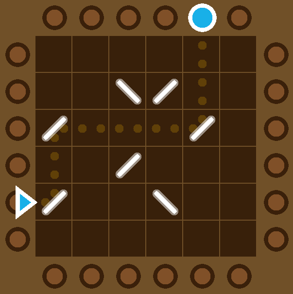

# [Open Pinball Recall](https://open-pinball-recall.vercel.app/)

This is a game to train working memory. It is a ripoff from Lumosity's Pinball Recall. It consists in memorizing the position and direction of bumpers in a grid and guessing the place where a ball will exit the grid given the place where it enters.

The game comes in various amounts of difficulty:

- [4x4](https://open-pinball-recall.vercel.app/#difficulty=4:5)
- [5x5](https://open-pinball-recall.vercel.app/#difficulty=5:6)
- [6x6](https://open-pinball-recall.vercel.app/#difficulty=6:9)
- [7x7](https://open-pinball-recall.vercel.app/#difficulty=7:12)

The difficulty is automatically adjusted depending on the success and failures of the player. A game usually consists of 7 plays
